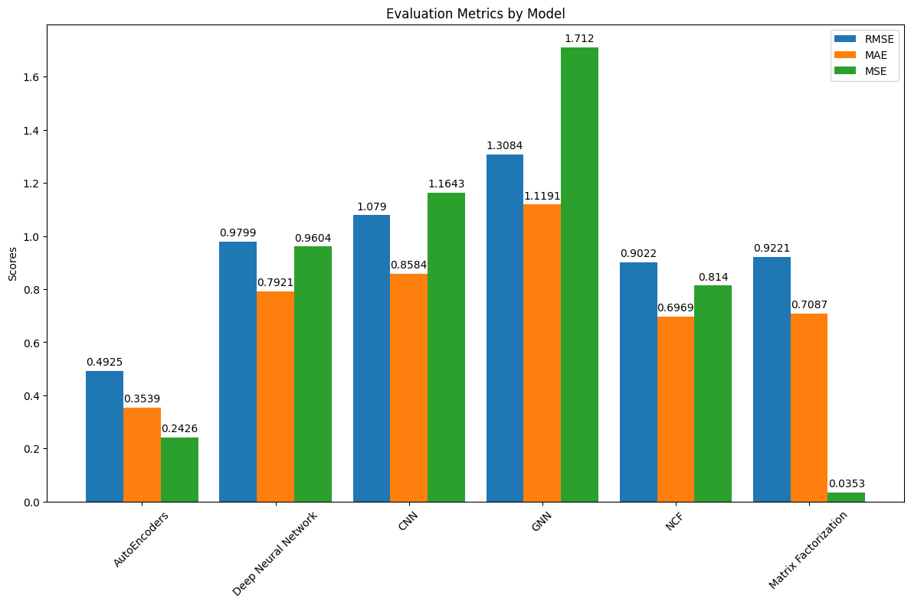
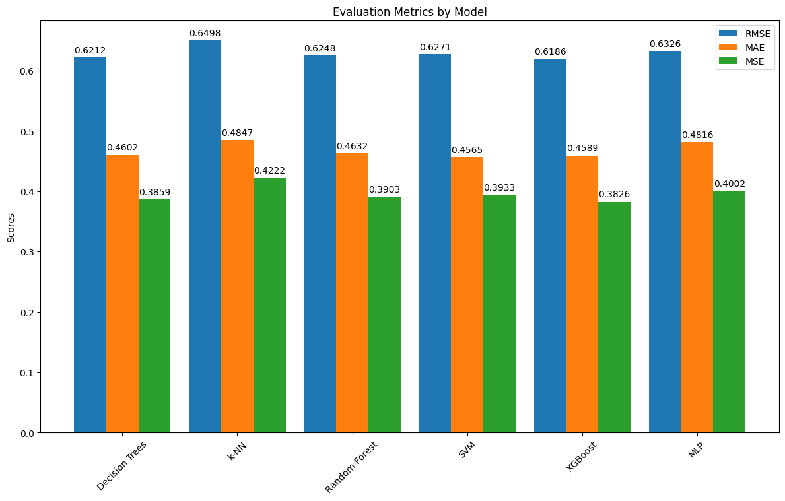

# MovieLens Deep Learning Models

This repository focuses on developing multiple deep learning models to make recommendation systems on the MovieLens dataset.

## Structure

The project is organized as follows:
```
├── notebooks
│   ├── collaborative_filtering
│   │   ├── AE.ipynb
│   │   ├── DNN.ipynb
│   │   ├── CNN.ipynb
│   │   ├── GNN.ipynb
│   │   ├── Matrix_factorization.ipynb
│   │   ├── NCF.ipynb
│   ├── content_based
│   │   ├── decision_trees.ipynb
│   │   ├── knn.ipynb
│   │   ├── random_forest.ipynb
│   │   ├── SVM.ipynb
│   │   ├── MLP.ipynb
│   │   ├── xgboost.ipynb
│   ├── hybrid
│   │   ├── Hybrid_NN.ipynb
│   ├── data_manipulation
│   │   ├── eda.ipynb
│   │   ├── transformations.ipynb
```


## Notebooks Description

### Collaborative Filtering:
- `AE.ipynb`: AutoEncoders Model for collaborative filtering.
- `DNN.ipynb`: Deep Neural Network Model for collaborative filtering.
- `CNN.ipynb`: Convolutional Neural Network Model for collaborative filtering.
- `GNN.ipynb`: Graph Neural Network Model for collaborative filtering.
- `Matrix_factorization.ipynb`: Matrix Factorization Techniques for collaborative filtering.
- `NCF.ipynb`: Neural Collaborative Filtering.

### Content Based:
- `decision_trees.ipynb`: Decision Trees Model for content-based filtering.
- `knn.ipynb`: K-Nearest Neighbors Model for content-based filtering.
- `random_forest.ipynb`: Random Forest Model for content-based filtering.
- `SVM.ipynb`: Support Vector Machine Model for content-based filtering.
- `MLP.ipynb`: Multi-Layer Perceptron Model for content-based filtering.
- `xgboost.ipynb`: XGBoost Model for content-based filtering.

### Hybrid:
- `Hybrid_NN.ipynb`: Hybrid Neural Network Model.

### Data Manipulation:
- `eda.ipynb`: Exploratory Data Analysis.
- `transformations.ipynb`: Data Transformations and Preprocessing.


# Hyperlink
From the following link, you can download the dataset used in this project:
[MovieLens](https://www.kaggle.com/datasets/rounakbanik/the-movies-dataset)

## Data Description

The data folder contains both the raw and cleaned datasets used in this project:
- `data`
- `lens`: Folder containing MovieLens datasets
- `cleaned`: Contains cleaned versions of datasets
- `links_cleaned.csv`: Cleaned links data
- `movies_cleaned.csv`: Cleaned movies data
- `ratings_cleaned.csv`: Cleaned ratings data
- `tags_cleaned.csv`: Cleaned tags data
- Other files in `lens` include raw datasets such as links, movies, ratings, and tags.


# Results

## Metrics 

1. **Mean Squared Error (MSE)**: 
   - *Description*: MSE is the average of the squares of the errors or deviations. It measures the average squared difference between the estimated values and the actual value.
   - *Interpretation*: A lower MSE value indicates better model performance with more accurate predictions. MSE gives more weight to larger errors due to squaring each error term.

2. **Mean Absolute Error (MAE)**:
   - *Description*: MAE is the average of the absolute errors between predicted values and observed values. It measures the average magnitude of the errors in a set of predictions, without considering their direction.
   - *Interpretation*: A lower MAE value signifies a better model with higher precision. MAE is less sensitive to outliers compared to MSE.

3. **Root Mean Squared Error (RMSE)**:
   - *Description*: RMSE is the square root of the mean of the squared errors. It measures the standard deviation of the residuals or prediction errors.
   - *Interpretation*: RMSE is more sensitive to outliers than MAE. A lower RMSE value denotes a model that predicts the data with higher accuracy.


## Collaborative Filtering

The following table shows the results of the different collaborative filtering models used in this project:

| Model                                | RMSE   | MAE    | MSE    |
|--------------------------------------|--------|--------|--------|
| AutoEncoders                         | 0.4925 | 0.3539 | 0.2426 |
| Deep Neural Network                  | 0.9799 | 0.7921 | 0.9604 |
| Convolutional Neural Network (CNN)   | 1.0790 | 0.8584 | 1.1643 |
| Graph Neural Network (GNN)           | 1.3084 | 1.1191 | 1.7120 |
| Neural Collaborative Filtering (NCF) | 0.9022 | 0.6969 | 0.8140 |
| Matrix Factorization                 | 0.9221 | 0.7087 | 0.0353 |


## Content Based    

The following table shows the results of the different content based models used in this project:

| Model          | RMSE   | MAE    | MSE    |
|----------------|--------|--------|--------|
| Decision Trees | 0.6212 | 0.4602 | 0.3859 |
| k-NN           | 0.6498 | 0.4847 | 0.4222 |
| Random Forest  | 0.6248 | 0.4632 | 0.3903 |
| SVM            | 0.6271 | 0.4565 | 0.3933 |
| XGBoost        | 0.6186 | 0.4589 | 0.3826 |
| MLP            | 0.6326 | 0.4816 | 0.4002 |

# Visualizations

The following figures show the results of the different models used in this project:

## Collaborative Filtering


## Content Based  


# Streamlit App
